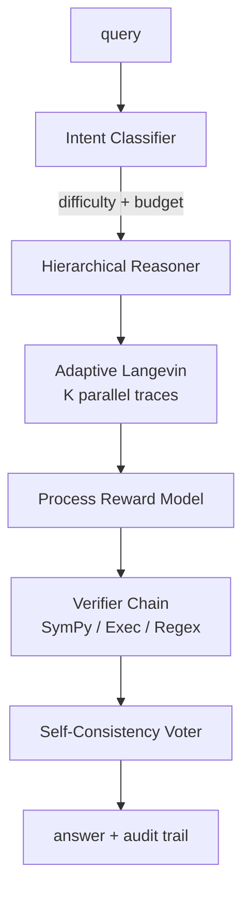

# Architecture

## Layers

### 1. Intent classifier
Routes queries and assigns a compute budget. Rule-based baseline in `ebrm_system.intent.RuleBasedClassifier`; swap with a neural classifier via the `Classifier` Protocol.

### 2. Hierarchical latent reasoner
Inner latent-thought loop. Coconut-inspired. Implemented in `ebrm_system.core` (WIP).

### 3. Adaptive Langevin
Test-time compute scaled with difficulty. `N` steps, `R` restarts, `K` parallel traces — all controlled by the classifier's `IntentPrediction`. Implemented in `ebrm_system.inference` (WIP).

### 4. Process reward model
Stepwise energy becomes per-trace confidence. Implemented in `ebrm_system.reward` (WIP).

### 5. Verifier chain
Mechanical checks: `SymPyVerifier` for algebraic equality, `ExecVerifier` for sandboxed Python, `RegexVerifier` for format. Composed via `VerifierChain`, which short-circuits on the first rejection.

### 6. Self-consistency voter
Aggregates K traces into a consensus. Supports exact and numerical bucketing, uniform / confidence / inverse-energy weighting.

## Design invariants

- **Mechanical verification only.** Verifiers never ask an LLM to grade an LLM.
- **Everything is a Protocol.** Swap any layer in one line.
- **CPU-testable.** Tests do not require GPUs or model downloads.
